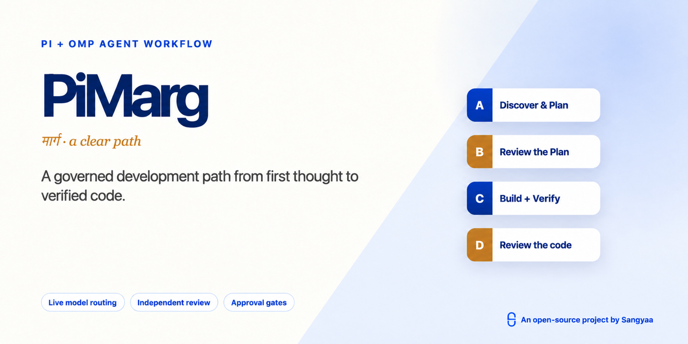

<p align="center">
  
</p>

<p align="center">
  <a href="https://github.com/sangyaahub/pi-marg/releases"></a>
  <a href="LICENSE"></a>
  <a href="https://pi.dev/packages?name=pi-marg"></a>
  <a href="https://omp.sh"></a>
</p>

# PiMarg

**Version 1.0.2 · MIT licensed · Pi Agent + Oh My Pi · by [Sangyaa](https://sangyaa.co)**

PiMarg turns an ordinary prompt into a governed development path. It identifies the work boundary, selects one engineering method, discovers the models and tools the active runtime really provides, separates thinking from execution, records evidence, and stops before protected actions.

```text
                           shared workflow core
                    intent · models · approvals · evidence
                                      │
                         ┌────────────┴────────────┐
                         ▼                         ▼
                     Pi adapter                OMP adapter
                  TypeBox · Pi events       Zod · OMP events
                         │                         │
                         └────────────┬────────────┘
                                      ▼
                  A discover → C plan review → plan gate
                                      │
                                      ▼
                       B build → verify → D review
                                      │
                                      ▼
                      security when needed → lessons
```

The same model-selection and approval logic lives in `core/`. Runtime-specific code is limited to `adapters/pi/` and `adapters/omp/`.

## Why PiMarg

- Confirms job/client versus personal work; job/client mode suppresses Sangyaa branding by default.
- Routes seven work types: idea, new feature, improvement, proactive bug fix, security, repository analysis, and business/sales analysis.
- Uses one primary Compound Engineering, Superpowers, GSD Core, or automatically selected workflow spine.
- Shows every current authenticated and enabled model, ranking the best fit for each stage first instead of pinning dated model names.
- Enforces that A and C use different underlying models, and B and D use different underlying models.
- Uses CodeGraph for repository architecture and impact when available, with LSP/AST or repository-native tools for exact code questions.
- Adds conditional testing, debugger, browser/desktop, security, Advisor, task, and memory routes only when detected.
- Tracks the plan, decisions, evidence, and one lesson under `.agent-work/sessions/`.
- Requires a one-use approval before delete/remove, push, merge, web publication, session sharing, or external-agent creation.

## Compatibility

| Capability | Pi Agent | Oh My Pi |
|---|---|---|
| Ordinary prompts enter the workflow | Pi bootstrap hook | OMP global rule |
| Shared skills and decision flow | Yes | Yes |
| Dynamic A/B/C/D model routing | Pi model registry | OMP model registry |
| Approval guard | Pi event adapter | OMP event adapter |
| Slash workflow entry points | Pi prompt templates | OMP commands |
| CodeGraph | CLI/integration when detected | MCP integration when configured |
| Advisor, checkpoint, security scan, Hindsight | Extension/fallback when detected | Native capability when enabled |
| Parallel agents | Only when a compatible task extension exists | Native `task`/workflow routes when available |

Tested locally against Pi Agent `0.85.1` and OMP `18.1.15`. Optional features are always capability-detected, so their absence produces a recorded fallback rather than a false success claim.

## Try the demo

Open [`demo/pi-marg-v1.0.html`](demo/pi-marg-v1.0.html) in a modern browser. It is self-contained and offline. Use **Play Flow** for a walkthrough or **Presenter Mode** to hide the configuration panel.

## Install

Review extensions before installation: both Pi and OMP packages execute with your local user permissions.

Preview the local installation commands:

```bash
./scripts/install.sh --runtime pi
./scripts/install.sh --runtime omp
```

Apply one runtime:

```bash
./scripts/install.sh --runtime pi --apply
./scripts/install.sh --runtime omp --apply
```

Install both only when you use both CLIs:

```bash
./scripts/install.sh --runtime both --apply
```

Install PiMarg from the Pi package catalog/npm:

```bash
pi install npm:@sangyaahub/pi-marg
```

Install the global OMP launcher:

```bash
npm install --global @sangyaahub/pi-marg
```

Or install Pi and OMP directly from this GitHub repository:

```bash
pi install https://github.com/sangyaahub/pi-marg
omp plugin marketplace add sangyaahub/pi-marg
omp plugin install --scope user pi-marg@pi-marg-marketplace
```

The npm command launches OMP; the OMP plugin installation supplies PiMarg's extensions, skills, commands, and rules. Install both when you want to start the complete workflow with `pi-marg` from any repository.

## Configure models

Authenticate providers using the active runtime's normal login flow, then run:

```text
/auto-models choose
```

The router shows every model in the live authenticated and enabled registry. Stage-appropriate choices appear first and all other enabled choices remain selectable. It does not promise that a subscription route is free or unlimited. See [MODEL-SETUP.md](MODEL-SETUP.md).

## Start a workflow

From a terminal in the repository you want to work on, run either:

```bash
pi-marg start
pi-marg "add CSV export to this repository"
```

`pi-marg start` opens OMP and asks for the work prompt. Supplying a prompt starts the same guided flow immediately. Inside an existing OMP session, invoke:

```text
/pi-marg
/pi-marg add CSV export to this repository
/auto add CSV export to this repository
```

The native picker asks for work boundary, work type, workflow skill, and every model required by that work type. It shows only models reported as authenticated and enabled by OMP, with recommended stage fits first.

Useful entry points:

- `/auto-models choose` — refresh A/B/C/D choices.
- `/auto-runtime status` — show detected capabilities and fallbacks.
- `/auto-review plan|code` — run the independent review contract.
- `/auto-status` — show the current ledger and evidence.
- `/auto-close` — verify completion and write the session lesson once.

On Pi these are prompt templates. On OMP they are command files. Ordinary new substantive prompts also enter the workflow automatically: Pi uses a lightweight bootstrap hook, while OMP loads the packaged global rule. The workflow instructions and state contract are shared.

## Protected actions

The default policy is `ask`. A protected action remains blocked until the complete next user message is exactly one of:

```text
APPROVE ACTION: delete-remove
APPROVE ACTION: push-main
APPROVE ACTION: merge-pr
APPROVE ACTION: post-web
```

Each phrase permits one matching call and is then consumed. Set `PIMARG_APPROVAL_POLICY=allow` before starting the runtime only when intentionally enabling automated protected actions. `UNIVERSAL_AUTO_MODE_APPROVAL_POLICY` and `OMP_AUTO_MODE_APPROVAL_POLICY` remain recognized for migration.

## CodeGraph policy

For an existing repository, preview setup first:

```bash
./scripts/setup-codegraph.sh /absolute/path/to/repository
```

Apply after reviewing the preview:

```bash
./scripts/setup-codegraph.sh --apply /absolute/path/to/repository
```

OMP can expose CodeGraph through `.mcp.json`. Pi uses a detected CodeGraph CLI or another installed integration. When CodeGraph is missing, the workflow may use precise repository-native tools, but it must not claim a repository-wide architecture or impact scan occurred.

## Project structure

```text
core/                    shared policy and routing logic
adapters/pi/             Pi extensions and prompt templates
adapters/omp/            OMP extensions
skills/                  shared workflow skills
commands/ agents/ rules/ OMP-native resources
demo/                    offline interactive presentation
tests/                   shared core and adapter contract tests
```

## Validate

```bash
./scripts/validate.sh
bun test tests
```

## License

PiMarg is an open-source project by [Sangyaa](https://sangyaa.co). Product branding uses Sangyaa's official mark and palette; see [BRAND.md](BRAND.md) for permitted use.

Copyright © 2026 Sangyaa and PiMarg contributors. Released under the [MIT License](LICENSE). Everyone may use, copy, modify, merge, publish, distribute, sublicense, or sell copies subject to the license notice and warranty disclaimer.

Contributions are welcome; see [CONTRIBUTING.md](CONTRIBUTING.md). Report vulnerabilities using [SECURITY.md](SECURITY.md).
